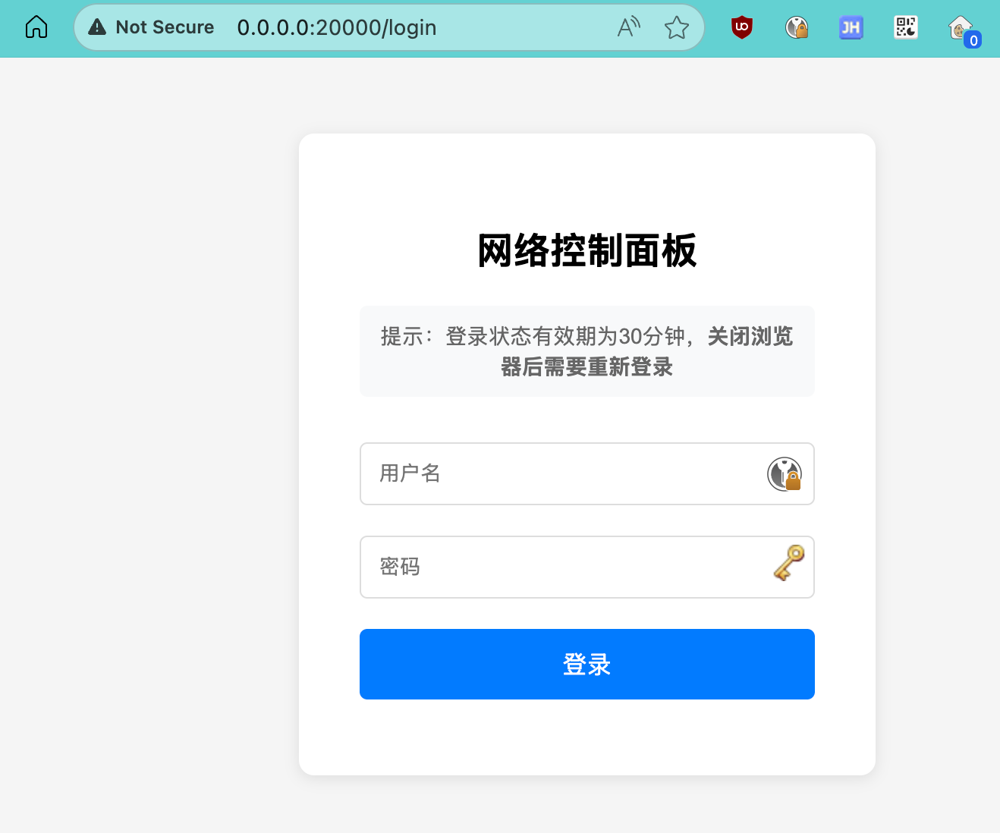
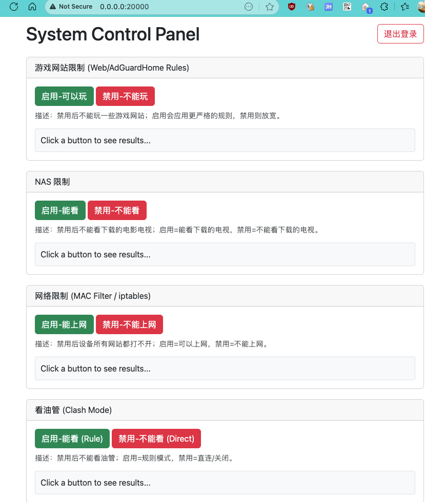

# Control Panel Web Service

一个轻量级的 Web 控制面板，运行在 OpenWRT ARM64 平台上，用于管理网络服务和设备限制。

## 产品截图

### 登录页面


### 控制面板


## 1. 项目概述

本项目是一个基于 Go 语言编写的 Web 服务，提供一个简单的 Web 控制页面，用于控制和管理特定服务的启用和禁用状态。后端通过执行预定义的 Shell 脚本来与这些服务交互。前端使用 jQuery 和 Bootstrap 构建，通过 AJAX 调用后端 API。

### 主要功能

- 🌐 **网站限制** - 通过 AdGuard Home 控制网站访问
- 💾 **NAS 限制** - 控制 NAS 服务的启用/禁用
- 🔒 **网络限制** - 基于 MAC 地址的设备网络控制
- 🚀 **代理限制** - Clash 代理模式切换

### 核心特性

- ✅ 完整的日志系统（可配置路径）
- ✅ 自动重启和健康检查
- ✅ 敏感信息配置分离
- ✅ 支持自定义端口
- ✅ 优雅关闭和错误恢复
- ✅ Session 管理和安全认证
- ✅ 脚本执行超时控制

## 2. 快速开始

### 编译

```bash
# macOS/Linux
./build_openwrt_arm64.sh

# Windows
build_openwrt_arm64.bat
```

### 配置

1. 复制配置模板：
```bash
cp config.example.json config.json
cd scripts
cp scripts.conf.example scripts.conf
```

2. 编辑配置文件，填入实际值

### 部署到 OpenWRT

```bash
# 使用自动部署脚本
./deploy_to_openwrt.sh 192.168.1.1

# 或手动部署
scp controlpanel_openwrt_arm64 config.json root@openwrt:/root/
scp -r scripts static root@openwrt:/root/
```

### 安装服务

```bash
ssh root@openwrt
cd /root
./install_service.sh
/etc/init.d/controlpanel start
```

## 3. 目录结构

```
/controlpanel/
├── controlpanel_openwrt_arm64  # Go 可执行文件 (ARM64)
├── main.go                     # Go 主程序
├── config.json                 # 主配置文件（不提交到 Git）
├── config.example.json         # 配置模板
├── static/                     # 前端静态资源
│   ├── index.html
│   ├── bootstrap.min.css
│   ├── jquery-3.7.1.min.js
│   └── bootstrap.bundle.min.js
├── scripts/                    # Shell 脚本
│   ├── scripts.conf            # 脚本配置（不提交到 Git）
│   ├── scripts.conf.example    # 脚本配置模板
│   ├── naslimit.sh
│   ├── netlimit.sh
│   ├── clashlimit.sh
│   ├── weblimit_1.sh
│   └── weblimit_103.sh
├── doc/                        # 文档和截图
│   ├── login.png
│   └── pannel.png
├── build_openwrt_arm64.sh      # 编译脚本 (macOS/Linux)
├── build_openwrt_arm64.bat     # 编译脚本 (Windows)
├── deploy_to_openwrt.sh        # 部署脚本
├── install_service.sh          # 服务安装脚本
├── start_controlpanel_improved.sh  # 启动脚本
├── watchdog.sh                 # 看门狗脚本
├── check_security.sh           # 安全检查脚本
├── README.md                   # 本文档
├── CONFIG.md                   # 配置说明
├── SCRIPTS_CONFIG.md           # 脚本配置说明
├── IMPROVEMENTS.md             # 改进说明
└── CHANGELOG.md                # 更新日志
```

## 4. 配置文件说明 (`config.json`)

`config.json` 文件用于定义后端 Go 程序调用的 Shell 脚本的路径。所有脚本路径都应相对于 Go 可执行文件的位置进行配置（例如，使用 `./scripts/` 前缀）。

示例 `config.json` 内容：

```json
{
  "nasLimitScript": "./scripts/naslimit.sh",
  "networkLimitScript": "./scripts/netlimit.sh",
  "clashLimitScript": "./scripts/clashlimit.sh",
  "websiteLimitScripts": [
    {
      "id": "weblimit_1",
      "scriptPath": "./scripts/weblimit_1.sh"
    },
    {
      "id": "weblimit_103",
      "scriptPath": "./scripts/weblimit_103.sh"
    }
  ]
}
```

- **nasLimitScript**: NAS 限制功能的脚本路径。
- **networkLimitScript**: 网络限制功能的脚本路径。
- **clashLimitScript**: 翻墙限制功能的脚本路径。
- **websiteLimitScripts**: 一个数组，包含多个网站限制脚本的配置。每个对象应有：
    - **id**: 脚本的唯一标识符 (用于日志和前端显示)。
    - **scriptPath**: 该网站限制脚本的路径。

**重要**: Go 程序在启动时会尝试从可执行文件所在目录加载 `config.json`。如果找不到，会尝试从当前工作目录加载。

## 5. Shell 脚本 (`scripts/` 目录)

所有业务逻辑由 `scripts/` 目录下的 Shell 脚本处理。Go 程序仅负责调用这些脚本，并传递 "enable" 或 "disable" 作为参数。

- 脚本必须具有可执行权限 (`chmod +x your_script.sh`)。
- 脚本应能正确处理接收到的第一个参数（"enable" 或 "disable"）。
- 脚本中使用的所有命令（如 `curl`, `iptables`, `jq` 等）必须在目标系统（如 OpenWrt）的 `PATH` 中，或者脚本应使用绝对路径调用这些命令。
- 脚本的标准输出和标准错误将作为 API 响应返回给前端。

## 6. 编译应用程序

### 5.1. 编译 OpenWrt ARM64 版本 (在 Windows 环境下)

1.  确保已安装 Go 环境。
2.  在项目根目录下，运行 `build_openwrt_arm64.bat` 批处理脚本：
    ```batch
    build_openwrt_arm64.bat
    ```
3.  成功后会在项目根目录下生成 `controlpanel_openwrt_arm64` 可执行文件。

### 5.2. 编译 Windows 版本 (用于本地测试)

1.  确保已安装 Go 环境。
2.  在项目根目录下，运行 `build_windows.bat` 批处理脚本：
    ```batch
    build_windows.bat
    ```
3.  成功后会在项目根目录下生成 `controlpanel_windows.exe` 可执行文件。

## 7. 部署到 OpenWrt

1.  **传输文件**：将以下文件和目录从您的开发计算机传输到 OpenWrt 设备的目标目录（例如 `/opt/controlpanel/`）：
    *   `controlpanel_openwrt_arm64` (编译好的可执行文件)
    *   `config.json`
    *   整个 `static/` 目录及其所有内容
    *   整个 `scripts/` 目录及其所有内容

    部署后的目录结构应如下所示：
    ```
    /opt/controlpanel/
    |-- controlpanel_openwrt_arm64
    |-- config.json
    |-- static/
    |   |-- index.html
    |   |-- bootstrap.min.css
    |   |-- jquery-3.7.1.min.js
    |   |-- bootstrap.bundle.min.js
    |-- scripts/
        |-- naslimit.sh
        |-- netlimit.sh
        |-- ... (其他脚本)
    ```

2.  **设置权限**：通过 SSH 连接到 OpenWrt 设备，然后设置正确的执行权限：
    ```sh
    chmod +x /opt/controlpanel/controlpanel_openwrt_arm64
    chmod +x /opt/controlpanel/scripts/*.sh
    ```

3.  **运行应用程序 (手动测试)**：
    ```sh
    cd /opt/controlpanel/
    ./controlpanel_openwrt_arm64
    ```
    此时，您应该可以通过浏览器访问 `http://<OpenWrt设备IP>:20000` 来查看控制页面。通过 `logread` 查看程序日志。

## 8. 设置 OpenWrt 开机自启动

为了使应用程序在 OpenWrt 设备启动时自动运行，需要创建一个 `procd` init 脚本。

1.  **创建 Init 脚本文件**：
    在 OpenWrt 设备上，创建文件 `/etc/init.d/controlpanel`：
    ```sh
    vi /etc/init.d/controlpanel
    ```

2.  **粘贴以下内容到脚本中** (请根据实际情况调整 `APP_BINARY` 和 `APP_ROOT_DIR`，如果您的部署路径不同的话)：
    ```sh
    #!/bin/sh /etc/rc.common

    SERVICE_NAME="Control Panel Web Service"
    APP_BINARY="/opt/controlpanel/controlpanel_openwrt_arm64"
    APP_ROOT_DIR="/opt/controlpanel"
    PID_FILE="/var/run/controlpanel.pid"

    START=95
    STOP=10

    start_service() {
        if [ ! -x "${APP_BINARY}" ]; then
            echo "Error: ${APP_BINARY} not found or not executable." >&2
            return 1
        fi
        if [ ! -d "${APP_ROOT_DIR}" ]; then
            echo "Error: ${APP_ROOT_DIR} not found." >&2
            return 1
        fi
        if [ ! -f "${APP_ROOT_DIR}/config.json" ]; then
             # Go 程序有回退到CWD的逻辑，且init脚本设置了CWD，理论上此处警告即可
            echo "Warning: config.json not found directly in ${APP_ROOT_DIR}. Check Go logs for load path." >&2
        fi

        procd_open_instance
        procd_set_param command "${APP_BINARY}"
        procd_set_param directory "${APP_ROOT_DIR}"  # <-- 非常重要：设置工作目录
        procd_set_param stdout # 转发 stdout 到系统日志
        procd_set_param stderr # 转发 stderr 到系统日志
        procd_set_param respawn # 崩溃时自动重启
        procd_set_param pidfile "${PID_FILE}"
        procd_close_instance
    }

    stop_service() {
        # procd 会处理停止进程
        return 0
    }
    ```

3.  **使 Init 脚本可执行**：
    ```sh
    chmod +x /etc/init.d/controlpanel
    ```

4.  **启用服务 (设置开机自启)**：
    ```sh
    /etc/init.d/controlpanel enable
    ```
    此命令会在 `/etc/rc.d/` 中创建必要的符号链接。

5.  **启动服务 (可选, 立即启动)**：
    ```sh
    /etc/init.d/controlpanel start
    ```

6.  **检查服务状态和日志**：
    *   状态: `/etc/init.d/controlpanel status`
    *   日志: `logread` 或 `logread -f | grep controlpanel` (如果 Go 程序日志中有特定关键词)

7.  **重启 OpenWrt 设备** 以验证开机自启是否生效。

## 9. 本地开发和调试

- 在 Windows 上，可以使用 `go run ./main.go` 运行程序进行快速调试。
- Web 页面访问 `http://localhost:20000`。
- **注意**：直接在 Windows 上通过 `go run` 执行 `.sh` 脚本会失败，因为 Windows 无法原生执行 Shell 脚本。错误信息通常是 `%! is not a valid Win32 application.`。为了在 Windows 上测试脚本调用，您可能需要：
    - 使用 WSL (Windows Subsystem for Linux) 或 Git Bash，并修改 Go 代码 (`executeScript` 函数) 以通过这些解释器执行脚本。
    - 创建等效的 `.bat` 或 `.ps1` 脚本用于 Windows 测试。
    - 在 `executeScript` 中暂时跳过实际执行，只打印日志。
- 主要的脚本功能完整性测试应在 OpenWrt 设备或配置了相应 Shell 环境的 Linux 虚拟机上进行。
- Go 程序的日志会输出到控制台，其中包含配置加载、脚本执行尝试等详细信息。

## 10. 监控和维护

### 查看日志

```bash
# 应用日志
tail -f /tmp/controlpanel_openwrt_arm64.log

# 查看错误
grep ERROR /tmp/controlpanel_openwrt_arm64.log

# 查看最近 100 行
tail -n 100 /tmp/controlpanel_openwrt_arm64.log
```

### 服务管理

```bash
# 启动服务
/etc/init.d/controlpanel start

# 停止服务
/etc/init.d/controlpanel stop

# 重启服务
/etc/init.d/controlpanel restart

# 查看状态
/etc/init.d/controlpanel status
```

### 健康检查

```bash
# 手动健康检查
./watchdog.sh check

# 设置定时检查（每 5 分钟）
echo "*/5 * * * * /root/watchdog.sh watch" >> /etc/crontabs/root
/etc/init.d/cron restart
```

## 11. 安全建议

- ✅ 配置文件 `config.json` 和 `scripts/scripts.conf` 已添加到 `.gitignore`
- ✅ 建议设置文件权限：`chmod 600 config.json scripts/scripts.conf`
- ✅ 使用强密码（至少 8 位，包含字母、数字、特殊字符）
- ✅ 定期更换密码和 Token
- ✅ 在提交代码前运行：`./check_security.sh`

## 12. 相关文档

- [CONFIG.md](CONFIG.md) - 详细配置说明
- [SCRIPTS_CONFIG.md](SCRIPTS_CONFIG.md) - 脚本配置说明
- [IMPROVEMENTS.md](IMPROVEMENTS.md) - 改进和新特性说明
- [CHANGELOG.md](CHANGELOG.md) - 更新日志

## 13. 故障排查

### 程序无法启动

```bash
# 检查日志
cat /tmp/controlpanel_openwrt_arm64.log

# 检查配置
cat /root/config.json

# 检查权限
ls -la /root/controlpanel_openwrt_arm64
chmod +x /root/controlpanel_openwrt_arm64
```

### 脚本执行失败

```bash
# 检查脚本配置
cat /root/scripts/scripts.conf

# 手动测试脚本
/root/scripts/naslimit.sh enable

# 检查脚本权限
chmod +x /root/scripts/*.sh
```

### 端口被占用

```bash
# 检查端口
netstat -tuln | grep 20000

# 修改端口（编辑 config.json）
vi /root/config.json
```

## 14. 注意事项

- **端口冲突**：确保端口 `20000` (或您在 `main.go` 中配置的 `serverPort`) 在 OpenWrt 设备上未被其他服务占用。
- **防火墙**：如果从局域网内其他设备访问此 Web 服务，确保 OpenWrt 的防火墙允许访问 TCP 端口 `20000`。
- **脚本依赖**：如果您的 Shell 脚本依赖特定的系统工具 (如 `iptables`, `curl`, `jq`, `ash`, `bash` 等)，请确保这些工具已在 OpenWrt 系统上安装并可用。
- **权限**：如果脚本执行需要 `root` 权限 (例如 `iptables` 操作)，确保 init 脚本是以 `root` 用户（默认）运行的。 